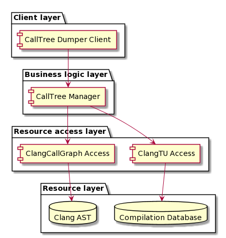

= INCode Design

== About
The design of INCode is based on the book <<RightingSoftwareBook,Righting Software>> by Juval Löwy (check out the Software Engineering Radio <<RightingSoftwarePodcast,podcast episode>>), mainly to apply the ideas onto a practical example.

INCode is a... %%TODO(KNR)%%

== Initial analyses
=== Essential use case analysis
%%TODO(KNR)%%

=== Volatility Analysis
The initial volatility analysis identifies:

- volatility on the axis of the same customer at different times: C++ versions, clang versions, GUI technologies, diagram languages
- volatility on the axis of multiple customers at the same time: ways to interact?!

=== Quality Attributes
Relevant quality attributes based on Part I, chapter 3, sub chapters Layered Approach/Using Services are:

- throughput (e.g. when applying INCode on large projects like LLVM)
- responsiveness (tool must respond in reasonable time while interacting)

All other quality attributes are currently not considered to be relevant:

- scalability
- security
- availability
- reliability
- consistency
- synchronization

== Volatility-based designs
=== Call-tree dumper

////
[plantuml, calltree-dumper-components, png]
....
folder "Client layer" {
  [CallTree Dumper Client]
}

folder "Business logic layer" {
  [CallTree Dumper Client] --> [CallTree Manager]
}

folder "Resource access layer" {
  [CallTree Manager] --> [ClangTU Access]
  [CallTree Manager] --> [ClangCallGraph Access]
}

folder "Resource layer" {
  database "Compilation Database"
  [ClangTU Access] --> [Compilation Database]

  database "Clang AST"
  [ClangCallGraph Access] --> [Clang AST]
}
....
////

[bibliography]
== References
- [[[RightingSoftwareBook]]]: link:https://rightingsoftware.org[Righting Software] by Juval Löwy, Addison-Wesley, 2020
- [[[RightingSoftwarePodcast]]]: Software Engineering Radio Episode 407: Juval Löwy on link:https://www.se-radio.net/2020/04/episode-407-juval-lowy-on-righting-software/[Righting Software]
- [[[AntifragileArchitecturePodcast]]]: Software Engineering Radio Episode 396: Barry O’Reilly on link:https://www.se-radio.net/2020/01/episode-396-barry-oreilly-on-antifragile-architecture/[Antifragile Architecture]
